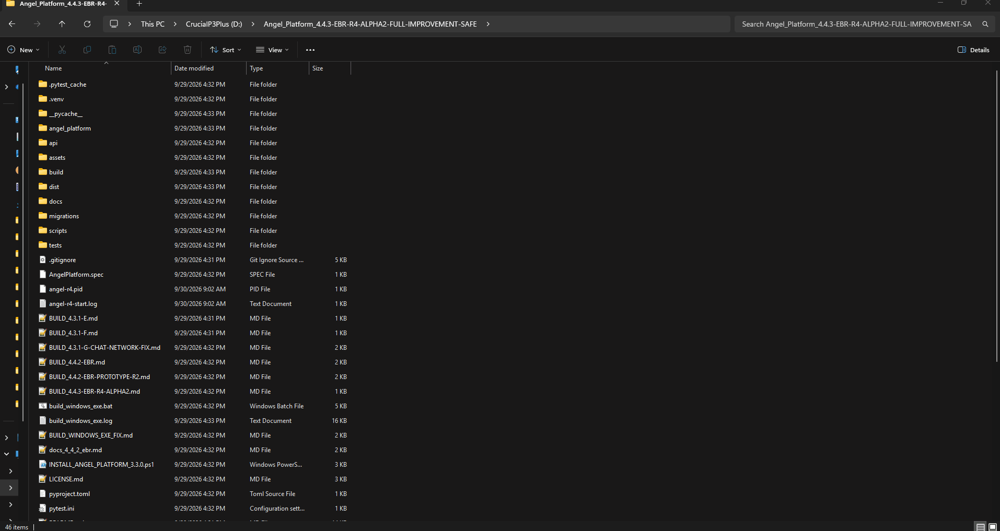

# Angel AI Harness

> **Angel Platform 4.4.3-EBR-R4-ALPHA2 — Evidence-Backed Reasoning & Context Integrity Build**  
> **"Peace Be The Journey" — Callan Palmer**

Angel AI Harness is the development repository for **Angel Platform**, a local-first AI assistant and system-management foundation built by **TCDOVERLORD**.

This build represents the **4.4.3-EBR-R4-ALPHA2** engineering checkpoint. It focuses on evidence-backed reasoning, response telemetry, retrieval/context integrity, conversational continuity, controlled execution, and a unified local workspace while preserving SQLite as the authoritative source of conversation data.

**Repository:** https://github.com/tcdoverlord/Angel-AI-Harness

---

## Angel AI Harness Logo

<p align="center">
  
</p>

## Example Demo

The following GIF provides a quick visual example of Angel AI Harness running locally:

<p align="center">
  
</p>

> **Demo:** Angel AI Harness local workspace and platform interface.

## Current Build

### Angel Platform 4.4.3-EBR-R4-ALPHA2

This build is documented as a full improvement build from the 4.4.2 EBR prototype line.

The 4.4.3 R4 Alpha2 build includes:

- R4 response telemetry contract
- Model invocation tracking
- Response hash and preview data
- Ordered RAG state history
- Terminal-state telemetry
- Suppression consistency between trace and diagnostics
- Controlled conflict fixtures under `TEST_MODE`
- Controlled retrieval-failure fixtures under `TEST_MODE`
- A-13, A-14, and A-15 context-integrity tests
- Async isolation coverage
- Windows start, stop, and test helper scripts
- Conversational continuity protection for short acknowledgements
- Local sale / nap / buyer conversation-thread continuity handling
- Clearer retrieval UI wording using **retrieved knowledge**
- Windows EXE packaging through `run_angel_4_2.py`
- Preservation of the **8780 engineering API** and **8765 Unified Workspace** paths used by R4 validation

The build deliberately does **not** replace SQLite authority and does **not** introduce a vector database, graph database, or retrieval-architecture redesign.

See `BUILD_4.4.3-EBR-R4-ALPHA2.md` for the build-specific engineering record.

---

## What Angel AI Harness Is

Angel is being developed as a locally controlled AI platform rather than only a chat interface.

The platform combines several layers:

```text
User
  │
  ▼
Angel Web Workspace
  │
  ├── Conversation Intelligence
  ├── Context Engine
  ├── Evidence-Backed Reasoning
  ├── Knowledge / Retrieval
  ├── Memory & SQLite Storage
  ├── Capabilities / Tools
  ├── Controlled Execution
  └── Engineering / Telemetry
          │
          ▼
     Local System
```

The architecture is intended to keep conversation, reasoning, storage, retrieval, execution, and diagnostics understandable and separately testable.

---

## Core Engineering Principles

Angel development is organized around several important principles:

### Local-first

Conversation state, knowledge resources, storage, and application components are designed to operate locally.

### Human control

System-changing or sensitive actions should be explicit and controlled rather than silently executed.

### Evidence-backed reasoning

The EBR work introduces a structured path for extracting, retrieving, validating, and injecting evidence-backed context.

### SQLite remains authoritative

Derived evidence structures are intended to remain rebuildable. The EBR prototype does not replace the authoritative conversation/message store.

### Context integrity

Angel is designed to reduce accidental retrieval of unrelated historical information when a conversation is continuing naturally.

### Controlled execution

Planning and execution are treated as separate concerns, with confirmation and safety checks around sensitive operations.

### Observable behavior

R4 introduces additional telemetry and diagnostics so model invocation, response state, retrieval state, and related engineering behavior can be inspected.

---

# Major Platform Components

## Angel AI

The intelligence and conversation layer provides the foundation for:

- Conversation handling
- Context processing
- Conversation intelligence
- Summaries
- Knowledge access
- Evidence-backed reasoning
- Local storage
- Model integration
- Response diagnostics

## Angel Nexus

Angel Nexus represents the platform's system and module-management direction.

The repository contains capabilities and execution infrastructure intended to support controlled:

- Tool discovery
- Module workflows
- System inspection
- Script execution
- Project operations
- Approval-aware actions

## Unified Workspace

The local browser workspace provides the primary application interface for the current platform line.

The R4 validation path uses:

```text
http://127.0.0.1:8765/
```

The engineering API path retained by this build uses:

```text
http://127.0.0.1:8780/
```

These endpoints are part of the documented R4 engineering/runtime arrangement and should not be assumed to represent permanent public API contracts.

---

# Evidence-Backed Reasoning

The 4.4.x EBR work introduces a structured reasoning path:

```text
SQLite Messages
      │
      ▼
Deterministic Extraction
      │
      ▼
Evidence Claims
      │
      ▼
Claim Sources
      │
      ▼
Exact-Key Retrieval
      │
      ▼
Scope / Provenance Validation
      │
      ▼
Structured Evidence Context
      │
      ▼
Model
```

The prototype includes explicit retrieval and diagnostic states such as:

```text
OFF
SEARCHING
HIT
HIT_VALIDATED
HIT_FILTERED
NO_EVIDENCE
CONFLICT_FOUND
SCOPE_BLOCKED
DERIVED_ONLY
REJECTED
ERROR
INJECTED
LOCAL
```

A key contract in the EBR implementation is that an `ERROR` state is not silently converted into `NO_EVIDENCE`.

---

# Context Integrity

The R4 build includes dedicated context-integrity work.

The test and validation structure includes:

- A-13 context continuity
- A-14 context integrity
- A-15 context integrity
- Async isolation
- Short-acknowledgement handling
- Conversation-thread continuity
- Retrieval isolation
- Controlled conflict scenarios
- Controlled retrieval-failure scenarios

The purpose is to preserve the active conversational thread instead of treating every short acknowledgement as a reason to retrieve unrelated historical information.

---

# Repository Structure

The repository currently contains the major areas below:

```text
Angel_AI_Harness/
│
├── angel_platform/
│   ├── capabilities/
│   ├── engineering/
│   ├── intelligence/
│   ├── knowledge/
│   ├── storage/
│   ├── webui/
│   ├── context_engine.py
│   ├── conversation_intelligence.py
│   ├── conversation_summary.py
│   ├── evidence_backed_reasoning.py
│   ├── evidence_confidence.py
│   ├── execution.py
│   └── core.py
│
├── api/
│   └── Angel_4.1_Canonical_OpenAPI.yaml
│
├── assets/
│
├── docs/
│   ├── architecture/
│   ├── planning/
│   ├── qa/
│   ├── releases/
│   └── ...
│
├── migrations/
│
├── scripts/
│
├── tests/
│   ├── context-integrity tests
│   ├── EBR tests
│   ├── routing safety tests
│   ├── storage tests
│   ├── execution tests
│   ├── UI tests
│   └── runtime/integration tests
│
├── AngelPlatform.spec
├── build_windows_exe.bat
├── run_angel_4_2.py
├── run_angel_platform.py
├── START_ANGEL_R4.bat
├── STOP_ANGEL_R4.bat
├── RUN_WINDOWS.bat
├── RUN_LINUX.sh
├── RUN_REPAIR_MODE.bat
├── requirements.txt
├── LICENSE.md
└── README.md
```

---

# Installation & First Run

## Windows — Easiest Method

For a Windows user who wants to run the packaged application, the repository's intended packaged application is the PyInstaller onedir build.

After obtaining a completed build, the application is located at:

```text
dist\AngelPlatform\AngelPlatform.exe
```

### 1. Start Angel

From the repository directory, run:

```text
RUN_WINDOWS.bat
```

The launcher checks for the packaged executable and starts it.

### 2. Open the Angel Workspace

The local workspace normally uses:

```text
http://127.0.0.1:8765/
```

Keep the application/runtime window available so startup errors can be reviewed if something goes wrong.

### 3. Stop Angel

For the R4 runtime workflow, use:

```text
STOP_ANGEL_R4.bat
```

The stop script terminates the tracked Angel process and removes the local PID file.

It does **not** delete persistent project data.

---

## Windows — Build the EXE Yourself

If the `dist\AngelPlatform\AngelPlatform.exe` package has not already been built, the repository includes a Windows build process.

### Requirements

The source build expects:

- Windows 10 or Windows 11, 64-bit
- Python 3.10 or newer
- PowerShell
- Internet access for installing Python packages

### Build

Open PowerShell in the repository directory and run:

```powershell
.\build_windows_exe.bat
```

The build process:

1. Locates Python.
2. Creates or reuses `.venv`.
3. Installs the required dependencies.
4. Validates the Python source.
5. Runs PyInstaller.
6. Verifies the resulting executable.

The PyInstaller specification is:

```text
AngelPlatform.spec
```

The expected packaged application is:

```text
dist\AngelPlatform\AngelPlatform.exe
```

The build log is:

```text
build_windows_exe.log
```

The repository's included build record reports a successful EXE build.

### Run the packaged build

After the build completes:

```text
RUN_WINDOWS.bat
```

This starts:

```text
dist\AngelPlatform\AngelPlatform.exe
```

**Important:** Angel is packaged as an **onedir** application. Keep the complete `dist\AngelPlatform\` directory together. Do not copy only the `.exe` to another location.

---

## Windows — Run from Source

Developers can run Angel directly from Python instead of using the packaged EXE.

From the repository directory:

```powershell
py -3 -m venv .venv
```

If the Python launcher is unavailable:

```powershell
python -m venv .venv
```

Install dependencies:

```powershell
.\.venv\Scripts\python.exe -m pip install --upgrade pip
.\.venv\Scripts\python.exe -m pip install -r requirements.txt
```

Validate the source:

```powershell
.\.venv\Scripts\python.exe -m compileall -q angel_platform run_angel_platform.py
```

Start the application:

```powershell
.\.venv\Scripts\python.exe -u .\run_angel_platform.py
```

Then open:

```text
http://127.0.0.1:8765/
```

---

## Linux — Run from Source

Basic source execution is available through the Linux launcher.

Create and activate a virtual environment:

```bash
python3 -m venv .venv
source .venv/bin/activate
```

Install dependencies:

```bash
python -m pip install --upgrade pip
python -m pip install -r requirements.txt
```

Validate:

```bash
python -m compileall -q angel_platform run_angel_platform.py
```

Start Angel:

```bash
python -u ./run_angel_platform.py
```

The repository also includes:

```text
RUN_LINUX.sh
```

Windows PyInstaller output is **not** the Linux launch method.

---

## Optional Ollama Setup

Angel can use local AI through Ollama when the relevant integration is enabled and configured.

Install Ollama from its official website:

```text
https://ollama.com/
```

Verify the installation:

```powershell
ollama --version
ollama list
```

Model names and integration behavior can change between development checkpoints. Confirm the model configured by the application matches the model installed on your system.

---

## R4 Runtime Workflow

The repository includes dedicated R4 start/stop helpers.

Start:

```text
START_ANGEL_R4.bat
```

The R4 startup workflow:

1. Locates the repository directory.
2. Checks for `run_angel_4_2.py`.
3. Checks that Python is available.
4. Enables the R4 provenance path.
5. Starts the Angel runtime.
6. Records the process ID.
7. Waits for the web workspace to respond.
8. Opens the local workspace.

Workspace:

```text
http://127.0.0.1:8765/
```

Startup log:

```text
angel-r4-start.log
```

Runtime PID:

```text
angel-r4.pid
```

Stop:

```text
STOP_ANGEL_R4.bat
```

---

# Linux

A Linux source launcher is included:

```text
RUN_LINUX.sh
```

It invokes:

```bash
python3 run_angel_platform.py
```

Basic source setup:

```bash
python3 -m venv .venv
source .venv/bin/activate
python -m pip install --upgrade pip
python -m pip install -r requirements.txt
python -m compileall -q angel_platform run_angel_platform.py
python -u ./run_angel_platform.py
```

The Windows PyInstaller executable is not the Linux launch method.

Platform-specific behavior should be validated on the target Linux distribution.

---

# Development Environment

The project is Python-based.

The package metadata currently declares:

```text
Python >= 3.10
```

The repository also contains development and test requirements.

Recommended source validation:

```powershell
python -m compileall -q angel_platform run_angel_platform.py
```

Additional project tests are located in:

```text
tests/
```

The test suite includes coverage for conversation behavior, context integrity, evidence-backed reasoning, routing, storage, execution, UI behavior, and runtime integration.

---

# Safety Model

Angel is designed around controlled automation rather than unrestricted system control.

Important development rules include:

- Review system-changing operations before execution.
- Keep read-only inspection separate from modification.
- Require explicit confirmation for sensitive actions where appropriate.
- Preserve visibility into commands, results, and failures.
- Avoid treating AI-generated commands as automatically safe.
- Maintain backups before important system or data changes.
- Keep credentials, tokens, private memory, and runtime state out of source control.
- Test destructive behavior explicitly rather than assuming it is safe.

Do not run unfamiliar scripts with administrator privileges without reviewing what they do.

---

# Data and Privacy

Angel can maintain local application state, including conversation and intelligence data.

The repository contains storage, knowledge, evidence, and runtime components, but local runtime state should not be committed to the public repository.

Keep the following out of source control:

- Credentials
- API keys
- Authentication tokens
- Private user data
- Local databases
- Runtime logs
- PID files
- Virtual environments
- Build output
- Machine-specific configuration
- Local model files
- Private memory/state

The repository's `.gitignore` is configured to exclude local/generated material.

---

## Where Angel Stores Chat History

Angel stores conversation data locally on the user's computer.

### Windows

The local Angel application data directory is:

```text
%USERPROFILE%\Angel_Platform\
```

For example:

```text
C:\Users\<YourUserName>\Angel_Platform\
```

### Linux

The local Angel application data directory is:

```text
~/Angel_Platform/
```

The 4.4.x EBR architecture keeps **SQLite as the authoritative conversation/message store**. The repository documentation also identifies local history compatibility data and other intelligence records as part of the local application data.

Depending on the active build and enabled features, the local Angel data area may contain:

- Conversation history
- Message records
- SQLite intelligence data
- Conversation/history compatibility data
- Approved memories
- Knowledge and evidence data
- Feedback records
- Tool/audit records
- Recovery information
- Runtime logs

### Important Privacy Note

Your Angel conversation history and related local intelligence data may contain sensitive personal or project information.

**Do not upload your local `Angel_Platform` data directory to a public GitHub repository.**

The public Git repository contains the Angel application source and documentation. A user's private conversation history belongs in the user's local application data, not in source control.

### Backing Up Chat History

Before reinstalling Angel, migrating to another computer, or making major storage changes, back up the user's local Angel data directory:

```text
Windows:
%USERPROFILE%\Angel_Platform\

Linux:
~/Angel_Platform/
```

Keep backups protected because they may contain private conversation and intelligence data.

Do not manually edit or delete the SQLite database unless you understand the storage schema and have a verified backup.

# Local AI and Model Providers

Angel has historically supported integration with local AI providers such as Ollama, depending on the active implementation and configuration.

Provider and model availability can change between development checkpoints.

Do not assume that a model mentioned in older documentation is required by this build. Review the active configuration and source before installing or selecting a model.

---

# Testing and Validation

The repository contains dedicated tests for several areas of the platform.

Examples include:

```text
tests/test_context_integrity_431g.py
tests/test_r4_context_integrity.py
tests/test_ebr_442.py
tests/test_ebr_r2_adversarial.py
tests/test_routing_safety.py
tests/test_execution.py
tests/test_platform.py
tests/test_unified_workspace_42.py
tests/test_read_aloud_ui.py
tests/test_quality_regression_431g.py
```

The 4.4.3 R4 build documentation specifically identifies A-13/A-14/A-15 context-integrity coverage and async isolation as part of the build.

For a local validation pass:

```powershell
python -m compileall -q angel_platform run_angel_4_2.py
```

Then run the relevant test modules for the area being changed.

---

# Engineering Documentation

The repository includes a substantial engineering record covering:

- Architecture decisions
- Requirements traceability
- Build manifests
- Release notes
- QA checklists
- Safe execution guidance
- Evidence-backed reasoning
- R4 telemetry
- Context-engine work
- Conversation intelligence
- Storage decisions
- Unified workspace governance
- Planning and rollback documentation

Important starting points include:

```text
BUILD_4.4.3-EBR-R4-ALPHA2.md
docs/r4_telemetry.md
docs/architecture/README_CURRENT_ARCHITECTURE.md
docs/architecture/Angel-Full-Program-Handbook.md
docs/architecture/Angel-Requirements-Traceability-Matrix.md
docs/qa/SAFE_EXECUTION.md
```

---

# Development Workflow

For controlled Angel development:

1. Inspect the current implementation.
2. Identify the smallest required change.
3. Preserve the existing working behavior.
4. Make one focused modification.
5. Run source validation.
6. Run the relevant tests.
7. Test the actual application interface.
8. Review logs and diagnostics.
9. Document the change.
10. Commit a focused change.

Useful Git checks:

```powershell
git status
git diff --stat
git diff
git log --oneline --decorate -5
```

Avoid destructive Git operations when they are not necessary.

---

# Project Direction

Angel is an evolving engineering project.

Current development direction includes:

- Local-first AI
- Evidence-backed reasoning
- Conversation and context integrity
- Persistent local intelligence
- Controlled tool execution
- Modular capabilities
- Engineering telemetry
- Knowledge management
- Unified workspace development
- Windows and Linux support
- Local AI provider integration
- Angel Nexus module and system-management workflows

Future work should be treated as development goals rather than guaranteed release commitments.

---

# Known Limitations

This is an engineering/alpha build.

Important limitations include:

- Some features remain experimental or development-stage.
- Platform behavior can vary between Windows and Linux.
- AI-generated responses can be inaccurate.
- Model/provider compatibility depends on configuration.
- Some system integrations require additional local dependencies.
- R4 telemetry and EBR components are engineering features under continued validation.
- The Windows executable is an onedir package and must remain with its packaged files.
- External services and providers can become unavailable or change behavior.
- Production suitability must be evaluated independently for the intended environment.

---

# License

This repository includes:

```text
LICENSE.md
```

The current project license is the **MIT License**.

Copyright:

```text
Copyright (c) 2026 TCDOVERLORD
```

The MIT license permits use, modification, distribution, and commercial use subject to its terms.

Third-party libraries, models, APIs, assets, fonts, icons, and services may have separate licenses and terms. Review those licenses before redistribution or commercial deployment.

---

# Repository

**Angel AI Harness**

https://github.com/tcdoverlord/Angel-AI-Harness

Maintainer identity:

**TCDOVERLORD**

Project:

**Angel AI / Angel Platform / Angel Nexus**

---

## Build Identity

```text
Project:        Angel AI Harness
Platform:       Angel Platform
Release line:   4.4.3
Build:          EBR-R4-ALPHA2
Focus:          Evidence-Backed Reasoning + Context Integrity
Runtime UI:     127.0.0.1:8765
Engineering API:127.0.0.1:8780
Packaging:      PyInstaller onedir
Primary OS:     Windows
Additional OS:  Linux source runtime
License:        MIT
```

> **Peace Be The Journey.**
